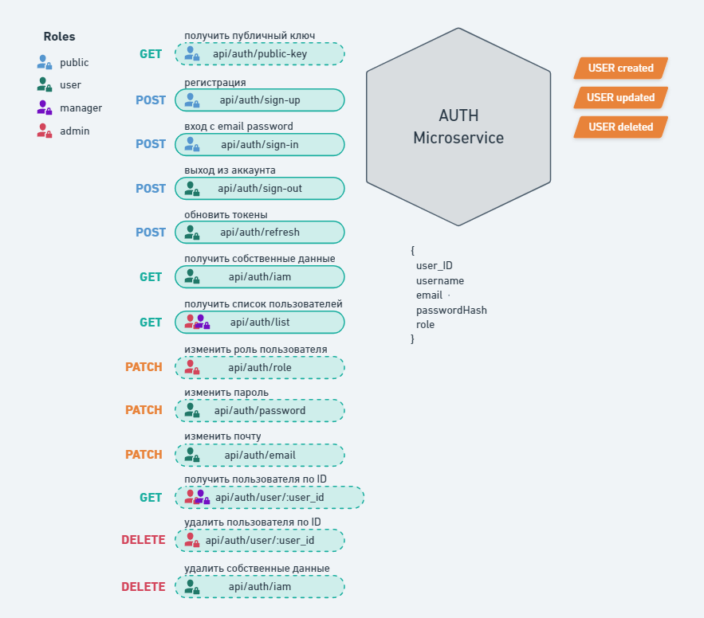

## Auth-microservice



##### add key pair RS256 to src/config/keys
- private.key `ssh-keygen -t rsa -b 2048 -m PEM -f private.key `
- public.key `ssh-keygen -e -m PEM -f private.key > public.key `

##### add .env files
```
.env

MONGO_LOGIN=
MONGO_PASSWORD=
MONGO_HOST=
MONGO_PORT=
MONGO_PORT_TEST=
MONGO_AUTHDATABASE=

JWT_ACCESS_EXPIRATION_TIME=
JWT_REFRESH_EXPIRATION_TIME=

ADMIN_USERNAME=
ADMIN_EMAIL=
ADMIN_PASSWORD=
```
```
.env.test

MONGO_LOGIN=
MONGO_PASSWORD=
MONGO_HOST=
MONGO_PORT=
MONGO_AUTHDATABASE=

JWT_ACCESS_EXPIRATION_TIME=
JWT_REFRESH_EXPIRATION_TIME=

ADMIN_USERNAME=
ADMIN_EMAIL=
ADMIN_PASSWORD=
```